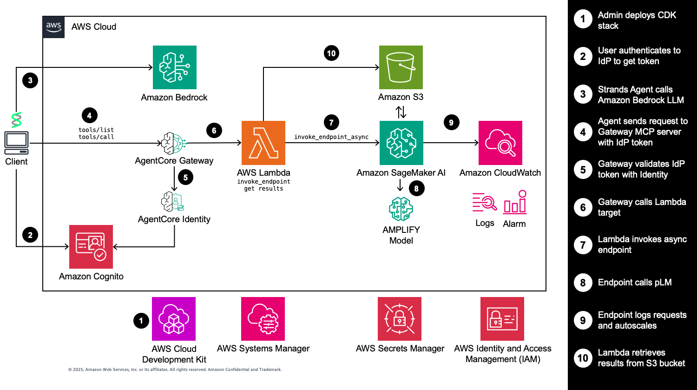

# Connect Drug Discovery Agents to Scientific Tools with Amazon Bedrock AgentCore Gateway

> [!IMPORTANT]
> The examples provided in this repository are for experimental and educational purposes only. They demonstrate concepts and techniques but are not intended for direct use in production environments.

AI agents are revolutionizing drug discovery by enabling researchers to rapidly analyze biological data and generate potential drug candidates. However, integrating complex scientific tools into scalable agent workflows remains a challenge. Traditional approaches require extensive custom integration work and struggle to handle the computational demands of biomolecular analysis at scale. This project demonstrates how Amazon Bedrock AgentCore Gateway can seamlessly connect AI agents to specialized protein engineering tools hosted on Amazon SageMaker AI and elsewhere through the Model Context Protocol (MCP).

## Overview

This CDK stack deploys a complete SageMaker async inference solution for the AMPLIFY protein variant effect prediction model, including:

- **SageMaker Async Endpoint**: GPU-optimized endpoint with auto-scaling
- **S3 Storage**: Auto-generated secure bucket for input/output data
- **Auto-scaling**: Scale to zero when idle, scale up based on queue backlog
- **Security**: IAM roles with least-privilege access
- **Reliable Cleanup**: No more S3 deletion issues during stack destruction

## Architecture



## Quick Start

### Prerequisites

- AWS CLI configured with appropriate permissions
- Node.js 18+ and npm
- Python 3.13+ with uv package manager
- AWS CDK CLI: `npm install -g aws-cdk`
- **uv**: Install from <https://docs.astral.sh/uv/getting-started/installation/>

### Installation

1. **Clone and setup**:

```bash
git clone <repository-url>
cd protein-engineering-agent
uv sync
```

2. **Install CDK dependencies**:

```bash
npm install
```

3. **Bootstrap CDK** (first time only):

```bash
uv run cdk bootstrap
```

### Deployment

1. **Deploy with defaults**:

```bash
uv run cdk deploy --all
```

2. Create Bedrock AgentCore Gateway

```bash
uv run deploy_agentcore.py
```

3. Get Token

```bash
uv run uv run get_token.py 
```

### Test with MCP Inspector

1. Install and start MCP Inspector

```bash
npx @modelcontextprotocol/inspector
```

2. Configuring the following parameters in the Inspector interface to connect to your gateway:

- Transport Type: Select Streamable HTTP
- URL: Enter gateway's MCP endpoint URL returned in the output of `deploy_agentcore_gateway.py`
- Authentication:
  - Header name: Authorization
  - Bearer token: The bearer token returned in the output of `get_token.py`

3. Select **Connect** to establish a connection to your gateway.
4. Select **List Tools** to view all available tools provided by your gateway.
5. Select the **protein-engineering-lambda__invoke_endpoint** tool.
6. Enter an amino acid sequence in the sequence test field (e.g. `FVNQHLCGSHLVEALYLVCGERGFFYTPKT`) and select **Run Tool**. Take note of the **output_id** value in the response message.
7. Select the **protein-engineering-lambda___get_results** tool.
8. Enter the **output_id** returned from step 6 in the output_id field and select **Run Tool**.
9. Depending on your autoscaling configuration, it may take several minutes to provision an endpoint instance and process the request. In the meantime, the **get_results** tool will return a "Prediction is still in progress" message.
10. Once the prediction is complete, **get_results** will download the result object from S3 and display the heatmap and outlier values in the response.

## Configuration

### Stack Parameters

| Parameter | Default | Description |
|-----------|---------|-------------|
| `InstanceType` | `ml.g6.2xlarge` | EC2 instance type for endpoint |
| `ModelId` | `chandar-lab/AMPLIFY_350M` | HuggingFace model identifier |
| ~~`S3BucketName`~~ | ~~Auto-generated~~ | ~~S3 bucket names are now auto-generated by CDK~~ |
| `MinCapacity` | `0` | Minimum instances (0 = scale to zero) |
| `MaxCapacity` | `2` | Maximum instances for auto-scaling |
| `MaxConcurrentInvocations` | `4` | Concurrent requests per instance |

**Note**: S3 bucket names are automatically generated by CDK (e.g., `sagemakerasyncstack-dev-asyncinferencebucket-xyz123`) to ensure uniqueness and avoid naming conflicts. You can find the actual bucket name in the stack outputs after deployment.

## Monitoring and Troubleshooting

### CloudWatch Metrics

Key metrics to monitor:

- **HasBacklogWithoutCapacity**: Triggers auto-scaling up

### CloudWatch Alarms

The stack creates several alarms:

- **HasBacklogWithoutCapacity-Alarm**: Triggers scale-up
- **NoBacklog-Alarm**: Triggers scale-down

### Common Issues

#### 1. Endpoint Creation Fails

```bash
# Check CloudFormation events
aws cloudformation describe-stack-events --stack-name VEPEndpointStack

# Check SageMaker endpoint status
aws sagemaker describe-endpoint --endpoint-name your-endpoint-name
```

#### 2. Auto-scaling Not Working

```bash
# Check scaling policies
aws application-autoscaling describe-scaling-policies \
  --service-namespace sagemaker \
  --resource-id endpoint/your-endpoint-name/variant/AllTraffic

# Check CloudWatch alarms
aws cloudwatch describe-alarms --alarm-names your-alarm-name
```

#### 3. High Latency or Errors

```bash
# Check endpoint logs
aws logs filter-log-events \
  --log-group-name /aws/sagemaker/Endpoints/your-endpoint-name \
  --start-time $(date -d '1 hour ago' +%s)000

# Check S3 access permissions
aws iam simulate-principal-policy \
  --policy-source-arn arn:aws:iam::account:role/sagemaker-execution-role \
  --action-names s3:GetObject s3:PutObject \
  --resource-arns arn:aws:s3:::your-auto-generated-bucket-name/*
```

#### 4. Finding Your Bucket Name

```bash
# Get bucket name from stack outputs
aws cloudformation describe-stacks \
  --stack-name VEPEndpointStack \
  --query 'Stacks[0].Outputs[?OutputKey==`AsyncInferenceBucketName`].OutputValue' \
  --output text
```

## Cost Optimization

### Auto-scaling Best Practices

1. **Scale to Zero**: Set `MinCapacity=0` to avoid idle costs
2. **Right-size Max Capacity**: Monitor usage patterns and adjust
3. **Optimize Concurrent Invocations**: Higher values = better utilization
4. **Use Spot Instances**: Consider for non-critical workloads

## Security Best Practices

### IAM Permissions

The stack follows least-privilege principles:

- SageMaker execution role has minimal required permissions
- S3 bucket access is restricted to specific prefixes
- CloudWatch logging is scoped to endpoint-specific log groups

### Network Security

For production deployments, consider:

```python
# Add VPC configuration to endpoint config
vpc_config = {
    'SecurityGroupIds': ['sg-12345678'],
    'Subnets': ['subnet-12345678', 'subnet-87654321']
}
```

### Data Encryption

- S3 bucket uses server-side encryption (SSE-S3)
- SageMaker endpoint encrypts data in transit
- Consider KMS encryption for sensitive data

## Advanced Configuration

### Custom Model Artifacts

```python
# Deploy with custom model
uv run cdk deploy VEPEndpointStack \
  --parameters ModelId=s3://my-bucket/my-model.tar.gz
```

### Integration with CI/CD

```yaml
# GitHub Actions example
- name: Deploy SageMaker Stack
  run: |
    uv run cdk deploy VEPEndpointStack \
      --require-approval never \
      --context environment=${{ github.ref_name }}
```

## Cleanup

### Delete Gateway

```bash
uv run delete_agentcore.py
```

### Destroy Stack

```bash
uv run cdk destroy --all
```

## Support and Contributing

### Getting Help

1. Check CloudFormation events for deployment issues
2. Review CloudWatch logs for runtime errors
3. Consult AWS SageMaker documentation
4. Open GitHub issues for bugs or feature requests

### Contributing

1. Fork the repository
2. Create a feature branch
3. Add tests for new functionality
4. Submit a pull request

## License

MIT-0
