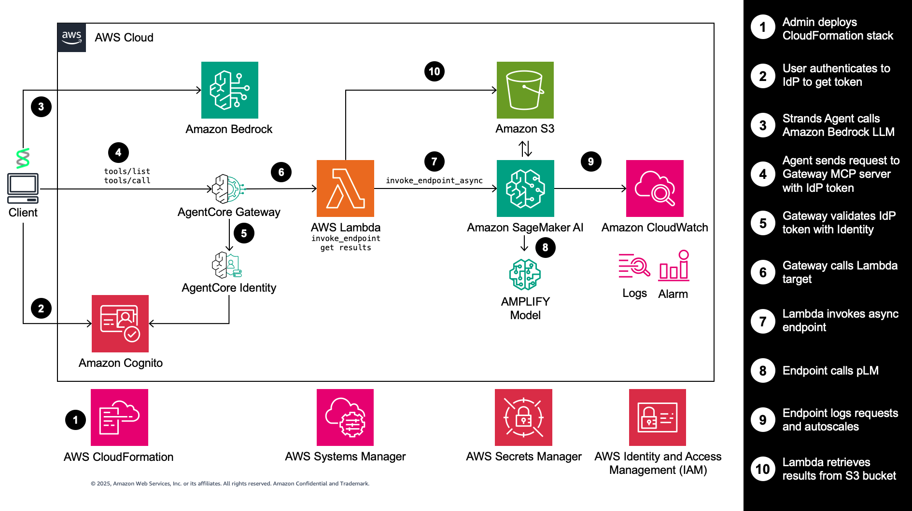

# Connect Drug Discovery Agents to Scientific Tools with Amazon Bedrock AgentCore Gateway

> [!IMPORTANT]
> The examples provided in this repository are for experimental and educational purposes only. They demonstrate concepts and techniques but are not intended for direct use in production environments.

AI agents are revolutionizing drug discovery by enabling researchers to rapidly analyze biological data and generate potential drug candidates. However, integrating complex scientific tools into scalable agent workflows remains a challenge. Traditional approaches require extensive custom integration work and struggle to handle the computational demands of biomolecular analysis at scale. This project demonstrates how Amazon Bedrock AgentCore Gateway can seamlessly connect AI agents to specialized protein engineering tools hosted on Amazon SageMaker AI and elsewhere through the Model Context Protocol (MCP).

## Overview

This project deploys a complete SageMaker async inference solution for the AMPLIFY protein variant effect prediction model using AWS CloudFormation, including:

- **SageMaker Async Endpoint**: GPU-optimized endpoint with auto-scaling
- **S3 Storage**: Auto-generated secure bucket for input/output data
- **Auto-scaling**: Scale to zero when idle, scale up based on queue backlog
- **Cognito Authentication**: OAuth2 client credentials flow for secure access
- **AgentCore Gateway**: MCP integration for AI agent communication
- **Security**: IAM roles with least-privilege access
- **Reliable Cleanup**: S3 bucket retention policy to prevent data loss

## Architecture



## Quick Start

### Prerequisites

- AWS CLI configured with appropriate permissions
- Python 3.13+ with uv package manager (for testing and examples)
- **uv**: Install from <https://docs.astral.sh/uv/getting-started/installation/>

### Installation

1. **Clone and setup**:

```bash
git clone <repository-url>
cd protein-engineering-agent
uv sync
```

### Deployment

Deploy all infrastructure using the CloudFormation deployment script:

```bash
cd cloudformation/scripts
./deploy.sh --project-name protein-engineering --region us-east-1
```

The deployment script will:

1. Validate all CloudFormation templates
2. Deploy the VEP Endpoint stack (SageMaker + Lambda)
3. Deploy the Cognito stack (authentication)
4. Deploy the Gateway stack (AgentCore Gateway)
5. Display all stack outputs including the Gateway URL

For detailed deployment instructions and configuration options, see [cloudformation/README.md](cloudformation/README.md).

### Testing

1. **Get OAuth Token**:

```bash
uv run get_token.py
```

2. **Test with MCP Inspector**:

```bash
npx @modelcontextprotocol/inspector
```

Configure the Inspector interface:

- Transport Type: Select Streamable HTTP
- URL: Enter the Gateway URL from deployment outputs
- Authentication:
  - Header name: Authorization
  - Bearer token: The token from `get_token.py`

3. **Test Protein Prediction**:
   - Select **Connect** to establish a connection
   - Select **List Tools** to view available tools
   - Select **protein-engineering-lambda__invoke_endpoint**
   - Enter an amino acid sequence (e.g. `FVNQHLCGSHLVEALYLVCGERGFFYTPKT`)
   - Select **Run Tool** and note the **output_id**
   - Select **protein-engineering-lambda___get_results**
   - Enter the **output_id** and select **Run Tool**
   - Wait for prediction completion (may take several minutes for first request)

## Configuration

### CloudFormation Parameters

The deployment can be customized using parameter files in `cloudformation/parameters/`:

**VEP Endpoint Parameters** (`vep-parameters.json`):

- `ProjectName`: Project identifier (default: `protein-engineering`)
- `InstanceType`: EC2 instance type (default: `ml.g6.2xlarge`)
- `ModelId`: HuggingFace model identifier (default: `chandar-lab/AMPLIFY_350M`)
- `MinCapacity`: Minimum instances (default: `1`, set to `0` for scale-to-zero)
- `MaxCapacity`: Maximum instances (default: `2`)
- `MaxConcurrentInvocations`: Concurrent requests per instance (default: `4`)
- `EnableAutoScaling`: Enable auto-scaling (default: `true`)

**Cognito Parameters** (`cognito-parameters.json`):

- `UserPoolName`: Cognito user pool name
- `ResourceServerIdentifier`: OAuth resource server identifier
- `ClientName`: OAuth client name
- `MinPasswordLength`: Minimum password length (default: `12`)

**Gateway Parameters** (`gateway-parameters.json`):

- `GatewayName`: AgentCore Gateway name
- `GatewayDescription`: Gateway description

For detailed configuration options, see [cloudformation/README.md](cloudformation/README.md).

## Monitoring and Troubleshooting

### CloudWatch Metrics

Key metrics to monitor:

- **HasBacklogWithoutCapacity**: Triggers auto-scaling up

### CloudWatch Alarms

The stack creates several alarms:

- **HasBacklogWithoutCapacity-Alarm**: Triggers scale-up
- **NoBacklog-Alarm**: Triggers scale-down

### Common Issues

#### 1. Stack Deployment Fails

```bash
# Check CloudFormation events
aws cloudformation describe-stack-events --stack-name protein-engineering-vep

# Check stack status
aws cloudformation describe-stacks --stack-name protein-engineering-vep
```

#### 2. Auto-scaling Not Working

```bash
# Check scaling policies
aws application-autoscaling describe-scaling-policies \
  --service-namespace sagemaker \
  --resource-id endpoint/your-endpoint-name/variant/AllTraffic

# Check CloudWatch alarms
aws cloudwatch describe-alarms --alarm-names your-alarm-name
```

#### 3. High Latency or Errors

```bash
# Check endpoint logs
aws logs filter-log-events \
  --log-group-name /aws/sagemaker/Endpoints/your-endpoint-name \
  --start-time $(date -d '1 hour ago' +%s)000

# Check S3 access permissions
aws iam simulate-principal-policy \
  --policy-source-arn arn:aws:iam::account:role/sagemaker-execution-role \
  --action-names s3:GetObject s3:PutObject \
  --resource-arns arn:aws:s3:::your-auto-generated-bucket-name/*
```

#### 4. Finding Stack Outputs

```bash
# Get all VEP stack outputs
aws cloudformation describe-stacks \
  --stack-name protein-engineering-vep \
  --query 'Stacks[0].Outputs'

# Get Gateway URL
aws cloudformation describe-stacks \
  --stack-name protein-engineering-gateway \
  --query 'Stacks[0].Outputs[?OutputKey==`GatewayUrl`].OutputValue' \
  --output text
```

## Cost Optimization

### Auto-scaling Best Practices

1. **Scale to Zero**: Set `MinCapacity=0` to avoid idle costs
2. **Right-size Max Capacity**: Monitor usage patterns and adjust
3. **Optimize Concurrent Invocations**: Higher values = better utilization
4. **Use Spot Instances**: Consider for non-critical workloads

## Security Best Practices

### IAM Permissions

The stack follows least-privilege principles:

- SageMaker execution role has minimal required permissions
- S3 bucket access is restricted to specific prefixes
- CloudWatch logging is scoped to endpoint-specific log groups

### Network Security

For production deployments, consider:

```python
# Add VPC configuration to endpoint config
vpc_config = {
    'SecurityGroupIds': ['sg-12345678'],
    'Subnets': ['subnet-12345678', 'subnet-87654321']
}
```

### Data Encryption

- S3 bucket uses server-side encryption (SSE-S3)
- SageMaker endpoint encrypts data in transit
- Secrets Manager stores Cognito client secrets securely
- Consider KMS encryption for sensitive data

## Advanced Configuration

### Custom Parameters

Edit parameter files in `cloudformation/parameters/` before deployment:

```bash
# Edit VEP parameters
vi cloudformation/parameters/vep-parameters.json

# Deploy with custom parameters
cd cloudformation/scripts
./deploy.sh --project-name my-project --region us-west-2
```

### Integration with CI/CD

```yaml
# GitHub Actions example
- name: Deploy CloudFormation Stacks
  run: |
    cd cloudformation/scripts
    ./deploy.sh \
      --project-name ${{ github.event.repository.name }} \
      --region us-east-1 \
      --instance-type ml.g6.2xlarge
```

## Cleanup

Delete all stacks in reverse order:

```bash
# Delete Gateway stack
aws cloudformation delete-stack --stack-name protein-engineering-gateway

# Delete Cognito stack
aws cloudformation delete-stack --stack-name protein-engineering-cognito

# Delete VEP stack
aws cloudformation delete-stack --stack-name protein-engineering-vep

# Note: S3 bucket is retained by default to prevent data loss
# Manually delete if needed:
aws s3 rb s3://your-bucket-name --force
```

For detailed cleanup instructions, see [cloudformation/README.md](cloudformation/README.md).

## Support and Contributing

### Getting Help

1. Check CloudFormation events for deployment issues
2. Review CloudWatch logs for runtime errors
3. Consult AWS SageMaker documentation
4. Open GitHub issues for bugs or feature requests

### Contributing

1. Fork the repository
2. Create a feature branch
3. Add tests for new functionality
4. Submit a pull request

## License

MIT-0
